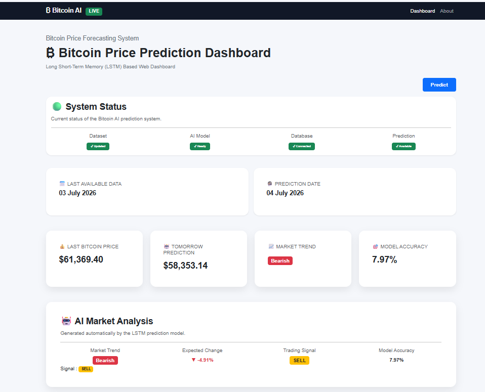
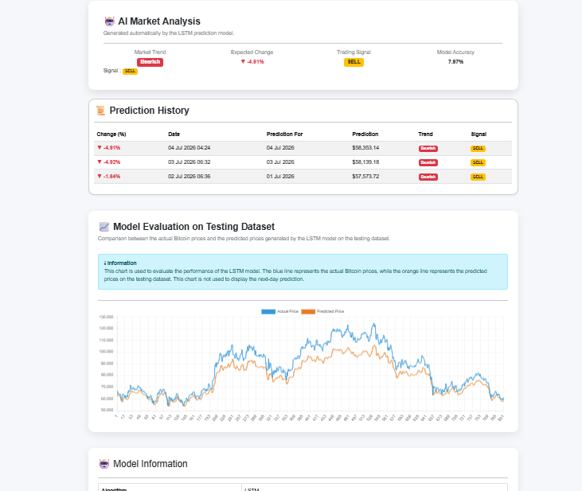
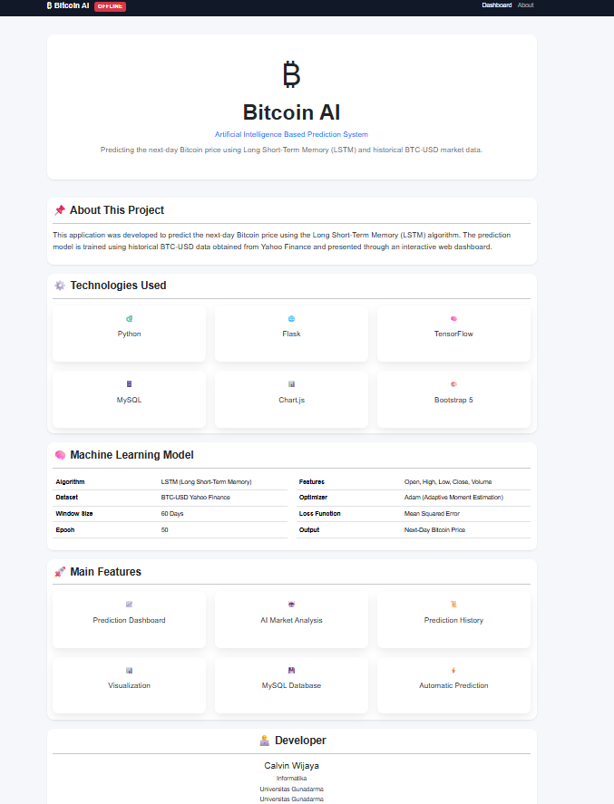

# ₿ Bitcoin AI Dashboard

## Web-Based Bitcoin Price Prediction Using Long Short-Term Memory (LSTM)
A web-based dashboard for predicting the next-day Bitcoin price using a Long Short-Term Memory (LSTM) neural network trained on historical Bitcoin data from Yahoo Finance.

------------------------------------------------------------------------------------------
### Project Information
| Item | Description |
|------|-------------|
| Project | Penelitian Ilmiah (PI) |
| University | Universitas Gunadarma |
| Study Program | Informatika |
| Developer | Calvin Wijaya |
| Year | 2026 |

------------------------------------------------------------------------------------------
## Overview
This project implements a Bitcoin price prediction system using a Long Short-Term Memory (LSTM) neural network.

The application automatically:

- Downloads the latest Bitcoin historical data from Yahoo Finance
- Updates the local dataset
- Performs next-day Bitcoin price prediction
- Stores prediction results into a MySQL database
- Displays prediction results through a Flask-based web dashboard

------------------------------------------------------------------------------------------
## Features
- Bitcoin price prediction using LSTM
- Automatic dataset update
- Automatic prediction pipeline
- Prediction history
- Model evaluation
- AI market analysis
- Dashboard visualization
- System status monitoring
- Graceful error handling
- Responsive web interface

------------------------------------------------------------------------------------------
## Technologies
| Technology | Usage |
|------------|-------|
| Python | Main Programming Language |
| Flask | Web Framework |
| TensorFlow / Keras | LSTM Model |
| MySQL | Database |
| Pandas | Data Processing |
| Scikit-learn | Data Preprocessing |
| Matplotlib | Model Evaluation |
| Chart.js | Dashboard Charts |
| Bootstrap 5 | User Interface |

------------------------------------------------------------------------------------------
## System Architecture
Yahoo Finance
       │
       ▼
Dataset Downloader
       │
       ▼
Preprocessing
       │
       ▼
LSTM Model
       │
       ▼
Prediction
       │
       ▼
MySQL Database
       │
       ▼
Flask Dashboard

------------------------------------------------------------------------------------------
## Machine Learning Workflow
Historical Data

↓

Preprocessing

↓

Train/Test Split

↓

MinMaxScaler

↓

LSTM Training

↓

Model Evaluation

↓

Save Model

↓

Next-Day Prediction

↓

Dashboard

------------------------------------------------------------------------------------------
## Folder Structure
PROJECT_PI_BITCOIN_LSTM/

│

├── app/
├── config/
├── dataset/
├── docs/
├── models/
├── scripts/
├── services/
├── tests/
├── app.py
├── requirements.txt
└── README.md

------------------------------------------------------------------------------------------
## Installation
git clone ...

cd PROJECT_PI_BITCOIN_LSTM

python -m venv .venv

pip install -r requirements.txt

------------------------------------------------------------------------------------------
## Run Project
python app.py

------------------------------------------------------------------------------------------
## Dashboard Modules
- Dashboard Overview
- Prediction Summary
- AI Market Analysis
- Prediction History
- Model Information
- About Developer
- System Status

------------------------------------------------------------------------------------------
## Dashboard Features
## Dashboard Modules
- Dashboard Overview
- Prediction Summary
- AI Market Analysis
- Prediction History
- Model Information
- About Developer
- System Status

------------------------------------------------------------------------------------------
## Screenshots
## Dashboard

---

## Prediction History

---

## About

------------------------------------------------------------------------------------------
## Developer
Calvin Wijaya

Informatika

Universitas Gunadarma

2026

------------------------------------------------------------------------------------------
## Future Improvements
- Multi-day prediction
- Additional technical indicators
- Hyperparameter optimization
- Real-time cryptocurrency API integration
- Deployment to cloud platform

------------------------------------------------------------------------------------------
## License
This project was developed for academic purposes as part of the Undergraduate Final Research (Penelitian Ilmiah) at Universitas Gunadarma.